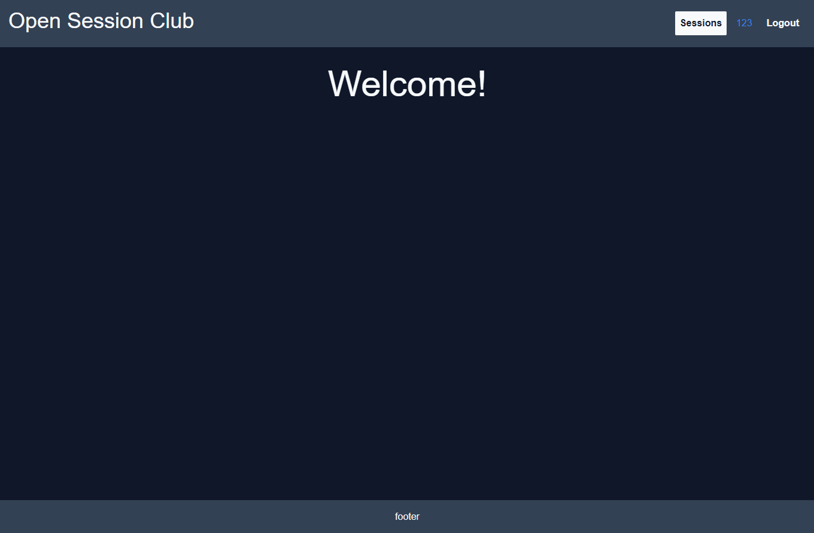

  

# Open Session Club

Learn, teach and open your mind.

## Project Status

The MVP is being built.

Main Features of the MVP:

- Actor (user) Authentication, Authorization & Settings
- Session CRUD & Sorting
- Session Comments CRUD
- Discord integration

After the MVP is built and in production some code refactoring and restructuring will take place to make it more maintainable and extendable.

Other TODOs before production ready:

- Logo
- UI Design
- Welcome page
- Legality

Preview from 04.12.2022:

## Development

### Server `(cd server)`

#### 1. Databases

&emsp;Make sure to have the databases PostgreSQL and Redis installed and running.

#### 2. Discord bot

&emsp;Create a discord server and bot.

#### 3. Environment variables

&emsp;See [constants.ts](./server/src/constants.ts) for variables that you need to define in a `.env` file in the `server` directory.

#### 4. Run `yarn watch`

&emsp;Starts the TypeScript compiler in watch mode.

#### 5. Run `yarn dev` or `yarn dev-linux`

- `yarn dev` starts a development server using nodemon.

- `yarn dev-linux` also starts the PostgreSQL and Redis databases.

> **_NOTE:_** Only works in Linux! Well at least in Ubuntu 20.04.5.

### Web `(cd web)`

#### 1. Run `yarn dev`

&emsp;Starts a development server using Vite
